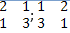

# Лабораторная работа 5. Массивы
## Задания:
### 1.	Заполнить массив значениями 34, 45, 56, 67, 78, 89. Результат в виде таблицы значений массива вывести на консоль.
### 2.	Реализовать перемножение двух матриц 2х2 . Результат в виде таблицы значений элементов результирующей матрицы вывести на консоль.
